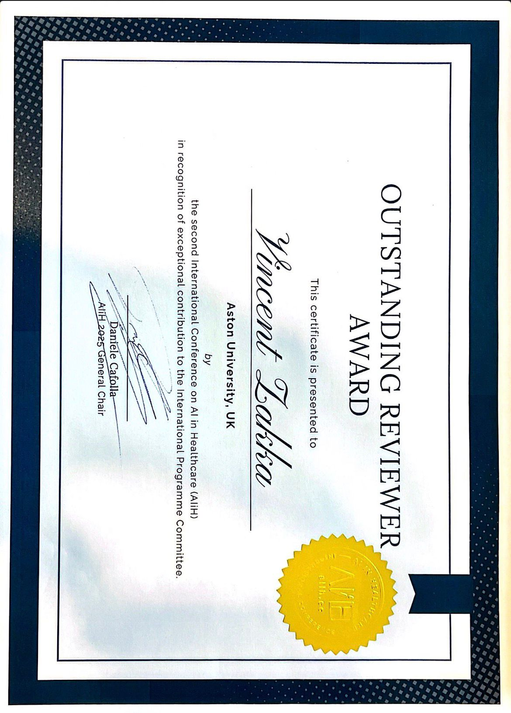
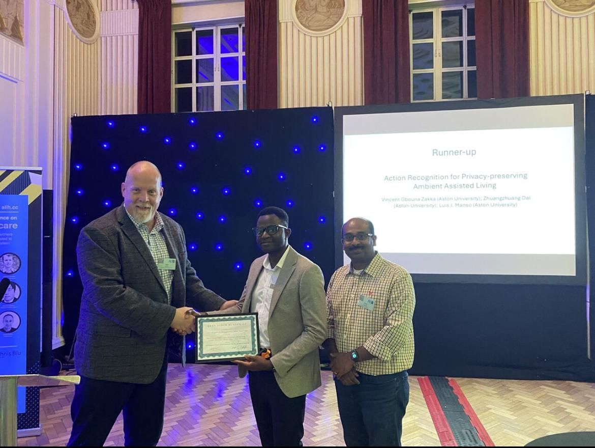
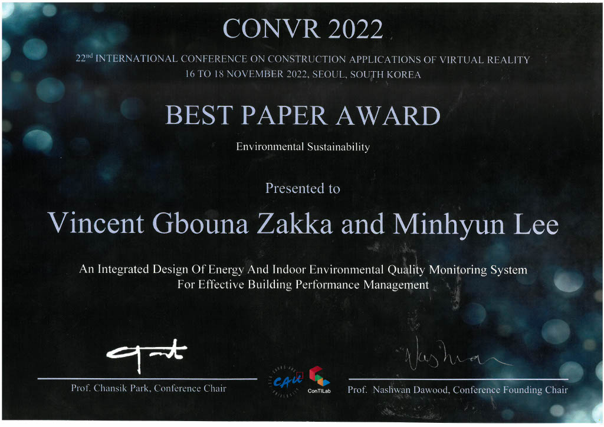
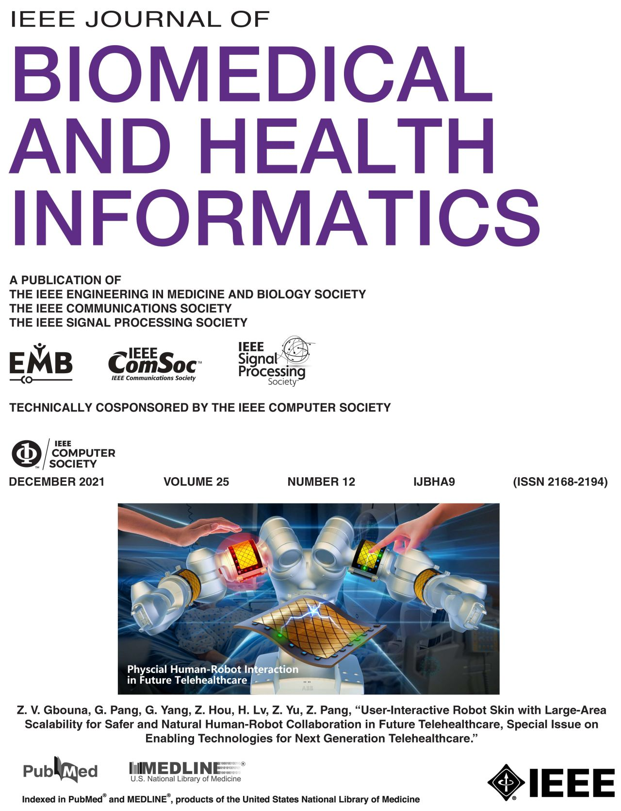



  
  

    <h2>Outstanding Reviewer Award: International Conference on AI in Healthcare 2025</h2>
    

      As part of the International Program Committee, I was honoured to receive the 
      <b>Outstanding Reviewer Award</b> at the AI in Healthcare Conference 2025, 
      in recognition of my contributions to the peer review process. It's a privilege to 
      support the scientific community and help maintain the quality of research in this 
      rapidly evolving field.
    

  

  
  

    <h2>Best Paper Award: Privacy-Preserving Activity Recognition for Ambient Assisted Living</h2>
    

      Our paper received the <b>Best Paper Award</b> for its innovative approach to 
      preserving user privacy in computer vision-based activity monitoring. 
      We introduced TD-GDSCN, which performs accurate activity recognition locally, 
      eliminating the need to stream sensitive data to the cloud.
    

    

      <a href="https://doi.org/10.1007/978-3-031-67285-9_15" class="link-btn" target="_blank">Paper</a>
      <a href="https://github.com/Gbouna/TD-GDSCN" class="link-btn" target="_blank">Code</a>
      <a href="https://www.youtube.com/watch?v=FExfkhTpHJA" class="link-btn" target="_blank">Demo</a>
    

  

  
  

    <h2>Best Paper Award: IoT-Based Monitoring System for Smart Building Energy and Environmental Management</h2>
    

      Our paper received the <b>Best Paper Award</b> for presenting an integrated, 
      non-invasive IoT-based monitoring system designed to improve energy efficiency 
      and indoor environmental quality (IEQ) in buildings. 
      The system combines hardware and software components to collect, process, 
      and visualise high-resolution energy and IEQ data in real time.
    

    

      <a href="https://arxiv.org/abs/2503.23323" class="link-btn" target="_blank">Paper</a>
    

  

  
  

    <h2>Featured Cover Paper: Enhancing Human-Robot Collaboration in Healthcare 4.0</h2>
    

      Our paper was <b>featured on the cover page</b>, highlighting our contribution to 
      safe and intuitive human-robot collaboration in Healthcare 4.0. 
      We proposed a modular proximity sensing solution based on self-capacitive technology, 
      enabling collaborative robots to detect approach and contact. 
      Operating in both interaction and safety modes, the system supports gesture-based control 
      and obstacle avoidance, enhancing telehealthcare delivery in human-centred environments.
    

  

